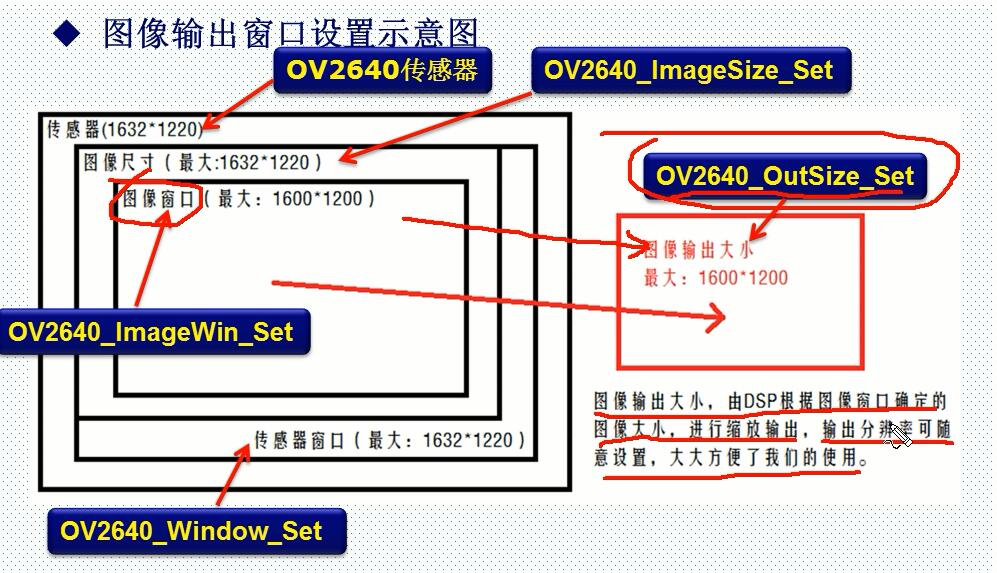

# OV2460

# OV2640简介-什么是OV2640

## 介绍：  
OV2640是OmniVision公司生产的一颗1/4寸的CMOS UXGA（1632*1232）图像传感器。该传感器体积小、工作电压低，提供单片UXGA摄像头和影像处理器的所有功能。通过SCCB 总线控制，可以输出整帧、子采样、缩放和取窗口等方式的各种分辨率8/10位影像数据。UXGA最高15帧/秒（SVGA可达30帧，CIF可达60帧）。用户可以完全控制图像质量、数据格式和传输方式。所有图像处理功能过程包括伽玛曲线、白平衡、对比度、色度等都可以通过SCCB接口编程。

## 特点：

1. 高灵敏度、低电压适合嵌入式应用。  
2. 标准的SCCB接口，兼容IIC接口。   
3. 支持**RawRGB**、RGB(**RGB565**/RGB555)、GRB422、YUV(422/420)和YCbCr（422）输出格式。  
4. 支持UXGA(1600*1200) 200W输出、SXGA、SVGA以及按比例缩小到从SXGA到40*30的任何尺寸 。
5. 支持自动曝光控制、自动增益控制、自动白平衡、自动消除灯光条纹、自动黑电平校准等自动控制功能。同时支持色饱和度、色相、伽马、锐度等设置。   
6. 支持图像**缩放**(DSP)和闪光灯    
7. 支持图像压缩，即**可输出JPEG图像**数据  

## 时序：  
### 基本概念：
1. **UXGA**，即分辨率位**1600*1200**的输出格式，类似的还有：SXGA(1280*1024)、XVGA(1280*960)、WXGA(1280*800)、XGA(1024*768)、**SVGA(800*600)**、VGA(640*480)、CIF(352*288)和QQVGA(160*120)等。  
2. PCLK，即像素时钟，一个PCLK时钟，输出一个RawRGB(或半个)像素。(***一个像素两个PCLK输出，RGB565一个像素两个字节***)  
3. VSYNC，即帧同步信号。  *（每一帧有一个 信号，信号的高低电平 可以设置）*
4. HREF /HSYNC，即行同步信号。  （行有效信号，一般是高电平有效，高电平 这一行有效）
5. OV2640的图像数据输出（通过Y[9:0]，不过我们只用**8位数据**）就是在PCLK，VSYNC和HREF/ ~~HSYNC~~的控制下进行的

### ov2640行输出时序

1200行，1600列  
ov2640行输出时序  
  
PCLK控制下 PCLK上升沿，HREF行有效信号高电平期间，每一个PCLK上升沿 会读取数据一个字节或者一个像素的数据Y[]，RGB565两个PCLK上升沿才会组成一个数据 最大1599（1600个数据，一行数据）  

图像数据在HREF为高的时候输出，当HREF变高后，每一个PCLK时钟，输出一个字节数据。比如我们采用UXGA时序，RGB565格式输出，每2个字节组成一个像素的颜色（低字节在前，高字节在后），这样每行输出总共有1600*2个PCLK周期，输出1600*2个字节

PCLK时钟最大达36M，如果MCU速度不够快，就得降低PCLK的频率，或者提高MCU频率

### ov2640帧输出时序(UXGA)
ov2640帧输出时序
 

帧输出时序以行为单位， 有一个帧同步信号VSYNC ，一个脉冲表示帧开始 ，帧脉冲高有效低有效可自己设置，帧通道信号来了之后 ，在27193tp以后 ，HREF变高，说明行数有效， 有1600tp，读取1600个数据 ，接着第二行，最后到1200行 ，最后完成了1200行数据的采集，每一行都有1600tp ，完成了1帧图像的采集。  

OV2640支持：RGB565或JPEG输出。RGB565输出时，时序如图所示。JPEG输出时，PCLK大大减少，且HREF不连续，数据流以0XFF,0XD8开头，以0XFF,0XD9结束，将此间数据保存为.jpg即可在电脑打开查看。

左下角小字，如果raw_data，1tp = 1T_PCLK ,如果RGB 1tp = 2T_PCLK.

### ov2640窗口设置  
ov2640窗口设置  
 

- 传感器窗口设置（OV2640_Window_Set）  
在传感器里面开窗，开窗范围从2*2~1632*1220。传感器窗口设置，通过：0X03/0X19/0X1A/0X07/0X17/0X18等寄存器设置，寄存器定义请看OV2640_DS(1.6).pdf这个文档（下同）  

- 图像尺寸设置（OV2640_ImageSize_Set）  
DSP输出（最终输出到LCD的）图像的最大尺寸，该尺寸要小于等于前面我们传感器窗口设置所设定的窗口尺寸。图像尺寸通过：0XC0/0XC1/0X8C等寄存器设置。

- 图像尺寸设置（OV2640_ImageSize_Set）   
在我们前面设置的图像尺寸里面，再一次设置窗口大小，该窗口必须小于等于前面设置的图像尺寸。该窗口设置后的图像范围，将用于输出到外部。图像窗口设置通过：0X51/0X52/0X53/0X54/0X55/0X57等寄存器设置。

- 图像输出大小设置（OV2640_OutSize_Set）  
图像输出大小设置，控制最终输出到外部的图像尺寸。该设置将图像窗口设置所决定的窗口大小，通过内部DSP处理，缩放成我们输出到外部的图像大小。该设置将会对图像进行缩放处理，如果设置的图像输出大小不等于图像窗口设置图像大小，那么图像就会被缩放处理，只有这两者设置一样大的时候，输出比例才是1：1的。图像输出大小通过：0X5A/0X5B/0X5C等寄存器设置。  

### ATK-OV2640介绍   
ATK-OV2640模块具有如下特点：  
1. 支持RGB565/JPEG数据输出   
2. 支持最大UXGA分辨率输出  
3. 支持图像任意缩放  
4. 自带24M有源晶振，无需外部时钟  
5. 自带稳压电路，接3.3V即可工作  
6. 自带感红外镜头（有滤光片），色彩鲜艳，可手动对焦 (默认3.6)
7. 体积小巧（27mm*27mm）  

实物图  
  

原理图  
  

对外接口
  
   
### ATK-OV2640模块初始化  
   

### MCU读取ATK-OV2640模块信号图像数据过程  （1帧数据的采集）
    

# DCMI接口简介-什么是DCMI？

## 介绍：  
DCMI是STM32F4芯片自带的一个数字摄像头接口，该接口是一个同步并行接口，能够接收外部8位、10位、12位或 14位 CMOS 摄像头模块发出的高速数据流。可支持不同的数据格式：YCbCr4:2:2/RGB565逐行视频和压缩数据 (JPEG)。  
DCMI接口可接收**高速（可达 54 MB/s）**数据流。该接口包含多达**14条数据线(D13-D0)和一条像素时钟线(PIXCLK)**。**像素时钟的极性可以编程**，因此可以在像素时钟的上升沿或下降沿捕获数据。  

## 特点：  
1. 支持8 位、10 位、12 位或 14 位并行接口  
2. 支持内嵌码/外部行同步和帧同步  
3. 支持连续模式或快照模式  
4. 支持裁剪功能  
5. 支持以下数据格式：  
  1，8/10/12/14 位逐行视频：单色或原始拜尔（Bayer）格式  
  2，YCbCr 4:2:2逐行视频  
  3，RGB 565 逐行视频  
  4，压缩数据：JPEG  
  
## DCMI信号    （stm32F4）
1。 数据据输入（D[0:13]），接摄像头的数据输出。   （这里2640只用输出8条，D0-D7）  
2。 水平同步（行同步）输入（HSYNC），接摄像头的HSYNC/HREF信号。  
3。 垂直同步（场同步）输入（VSYNC），接摄像头的VSYNC信号。  
4。 像素时钟输入（PIXCLK），接摄像头的PCLK信号。    
  

### DCMI信号说明  

DCMI接口的数据与PIXCLK（即PCLK）保持同步，并根据像素时钟的极性在像素时钟上升沿/下降沿发生变化。HSYNC（HREF）信号指示行的开始/结束，VSYNC信号指示帧的开始/结束。
 
图中，对应设置为：DCMI_PIXCLK的捕获沿为下降沿，DCMI_HSYNC和DCMI_VSYNC的有效状态为1。  
**注意：这里的有效状态实际上对应的是指示数据在并行接口上无效时，HSYNC/
VSYNC引脚上面的引脚电平。**  

### DCMI数据说明

DCMI接收到的数据，存储在**DCMI_DR寄存器（32位）**里面，我们接ATK-OV2640采用8位数据宽度，所以每4个像素时钟，才会捕获完32位数据，**（也就是每次收到4个PCLK，才把EDCMI_DR寄存器填满）**，第一个字节存放在LSB位置，第四个字节存放在MSB位置，**（低字节在前，高字节在后）**，如下图所示:  
   

### DMA说明

DCMI支持DMA传输，当DCMI_CR寄存器中的CAPTURE位置1时，激活DMA接口。  
摄像头接口每次在其寄存器(DCMI_DR)中收到一个完整的32位数据块时，都将发一个DMA请求，由DMA将DCMI_DR寄存器的值搬运到目的地址(比如LCD/SRAM)。
  
DCMI的DMA请求是映射在DMA2通道1的数据流1上面的，所以配置DMA时，应该配
置这个。  
另外，如果是直接DCMIDMALCD的传输方式，因为LCD是16位宽（RGB565），
而DCMI_DR是32位宽，**所以，一次DCMI引起的DMA传输，将引发往LCD写2次数据**.

### 其他说明

模式：DCMI支持连续模式和快照模式，我们一般采用**连续模式**。  
同步方式：DCMI支持内嵌码同步和硬件同步两种方式，我们一般采用硬件同步。    
**硬件同步**模式下使用两个同步信号 ：HSYNC和VSYNC。根据摄像头模块/模式的不同，可能在水平（行）/垂直（场）同步期间内发送数据。由于系统会忽略HSYNC/VSYNC信号有效电平期间内接收的所有数据，HSYNC/VSYNC 信号相当于消隐信号。  

## DCMI寄存器介绍  

### DCMI控制寄存器（DCMI_CR）  
  
**ENABLE**，用于设置是否使能DCMI。在使能之前，必须将其他配置设置好。  **（先配置其他，再使能，倒数第二）**  
**FCRC[1:0]**，这两个位用于帧率控制，我们捕获所有帧，所以设置为00即可。 （可设置像取1.3.5帧...这样）    
**VSPOL**，用于设置垂直同步极性，也就是VSYNC引脚上面，**数据无效时的电平状态**，根据前面说所，我们应该设置为0。  ***(YSYNC有效时电平状态和设置相反)***  
**HSPOL**，用于设置水平同步极性，也就是HSYNC引脚上面，**数据无效时的电平状态**，同样应该设置为0。 ***(HSYNC有效时电平状态和设置相反)***   
**PCKPOL**，用于设置像素时钟极性，我们用上升沿捕获，所以设置为1。  
**CM**，用于设置捕获模式，我们用连续采集模式，所以设置为0即可。  (快照模式设置1)
**CAPTURE**，用于使能捕获，我们设置为1。该位使能后，将激活DMA，DCMI等待第一帧开始，然后生成DMA请求将收到的数据传输到目标存储器中。  **（一般最后设置CAPTURE这位，CAPTURE位必须在其他所有配置（包括DMA）完成后，才使能！）**  

### DCMI中断使能寄存器（DCMI_IER）
  
五个位有效，这里只介绍FRAME位。  
**FRAME_IE**，捕获完成中断使能位。实际上就是**帧中断**。  
我们在jpeg数据处理的时候，要用到帧中断，所以设置该位为1。  

## DCMI初始化流程

***1. 配置相关引脚的复用功能，使能DCMI时钟。***    
  要用DCMI，先要**使能DCMI的时钟**。其次要设置**DCMI的相关引脚为复用输出**，以便连接ATK-OV2640模块。  
***2. 设置DCMI工作模式及PCLK/HSYNC/VSYNC等参数。***    
  DCMI接口，我们使用8位接口，**连续模式**，根据OV2640模块的输出时序图，设置：PCLK为上升沿有效，**（有效电平）**，   HSYNC和VSYNC为低电平有效。同时还要设置帧中断（jpeg数据采集用）等参数。  
***3. 设置DMA。***    
  DCMI数据，我们一般采用DMA来搬运，所以，设置好DCMI相关参数后，需要设置DMA，以便采集数据。  
***4. 启动DCMI传输。***    
   **最后，设置DCMI->CR的最低位为1(CAPTURE位置1)**，即可启动DCMI捕获图像数据。 

  

